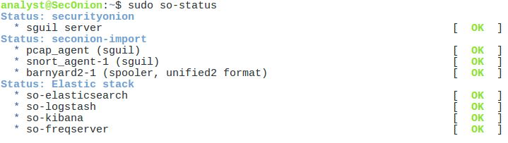

# Practica de Laboratorio - Extraer un ejecutable de un PCAP
## Objetivos
En esta práctica de laboratorio, analizará registros durante un explotamiento malicioso de vulnerabilidades HTTP y DNS documentadas.

MySQL es una base de datos popular que utilizan numerosas aplicaciones web. Desafortunadamente, la Inyección SQL es una técnica de hacking web común. Es una técnica de inyección de código en la que un atacante ejecuta comandos SQL maliciosos para controlar el servidor de bases de datos de una aplicación web.

Los servidores de nombres de dominio (Domain Name Servers, DNS) son directorios de nombres de dominio y traducen los nombres de dominio a direcciones IP. Este servicio puede utilizarse para exfiltrar datos.

El personal de ciberseguridad ha determinado que una vulnerabilidad ha ocurrido, y los datos que contienen PII pueden haber estado expuestos a agentes de amenazas En este laboratorio, utilizará Kibana para investigar las vulnerabilidades para determinar los datos que se exfiltraron utilizando HTTP y DNS durante los ataques.

---

### Parte 1: Investigar un ataque de Inyección SQL
En esta parte, investigará una vulnerabilidad en el que se realizó acceso no autorizado a la información confidencial que se almacena en un servidor web. Utilizará Kibana para determinar el origen del ataque y la información a la que accede el atacante.

**Paso 1: Cambiar el plazo**
Se ha determinado que la vulnerabilidad ocurrió en algún momento durante el mes de junio de 2020. Kibana muestra los datos de forma predeterminada durante las últimas 24 horas. Tendrá que cambiar la configuración de la hora para ver los datos del mes de junio de 2020.

1. Inicie sesión en Security Onion con el nombre de usuario “analyst”, y la contraseña “CyberOPS”.

2. Introduzca el comando sudo so-status para comprobar el estado de los servicios. El estado de todos los servicios debe estar OK antes de iniciar el análisis. Esto podría demorar unos minutos.

     
    <em>Img 1: Todo OK.</em>

3. Después de iniciar sesión, abra Kibana usando el acceso directo en el escritorio. Inicie sesión con el
nombre de usuario analyst y la contraseña cyberops.

4. En la esquina superior derecha de la ventana, haga clic en Last 24 hours en para cambiar el tamaño del intervalo de tiempo de la muestra. Expanda el intervalo de tiempo para incluir las alertas interesantes. Un ataque de inyección SQL tuvo lugar en junio de 2020, por lo que es lo que necesita revisar. Seleccione Absolute en Intervalo de tiempo y edite las horas Desde y Hasta para incluir todo el mes de junio de 2020. Haga clic en Go para continuar.

5. Observe el número total de registros para todo el mes de junio de 2020. El panel debe ser similar al que se muestra en la figura. Tómese un momento para explorar la información proporcionada por la interfaz de Kibana.

     
    <em>Img 2: Numero total de Registros.</em>

**Paso 2: Filtrar para el tráfico HTTP.**

1. Dado que el atacante evaluó los datos almacenados en un servidor web, el filtro HTTP se utiliza para seleccionar los registros asociados con el tráfico HTTP. Seleccione HTTP bajo el encabezado Zeek Hunting, como se muestra en la figura.

     
    <em>Img 3: Filtro por HTTP.</em>

Revise los resultados y responda las siguientes preguntas:
**¿Cuál es la dirección IP de origen?**

     
    <em>Img 4: IP de origen.</em>

**¿Cuál es la dirección IP de destino?**

     
    <em>Img 5: IP de destino.</em>

**¿Cuál es el número de puerto de destino?**

     
    <em>Img 6: Numero de puerto.</em>

2. Desplácese hasta la sección HTTP. El resultado muestra los 10 primeros resultados.

3. Expanda los detalles del primer resultado haciendo clic en la flecha que se encuentra junto a la marca de tiempo de entrada de registro. Tenga en cuenta la información disponible.

**¿Cuál es la marca de tiempo del primer resultado?**

     
    <em>Img 7: Timestamp.</em>

**¿Cuál es el tipo de evento?**

     
    <em>Img 8: Event type.</em>

**¿Qué se incluye en el campo de mensaje? Estos son detalles sobre la solicitud HTTP GET que realizó el cliente al servidor. Enfocado especialmente en el uri field en el mensaje de texto.**

     
    <em>Img 9: Message.</em>

Este URI contiene varios parámetros, como “`page`”, “`action`”, “`customer_id`” y “`account_id`”. Estos parámetros indican qué recurso se solicitó y pueden ser útiles para comprender qué tipo de información o servicio se estaba accediendo. Por ejemplo:

- “`page`”: El valor es “`actions`”, lo que sugiere que se está accediendo a una página relacionada con acciones o funcionalidades específicas.
- “`action`”: El valor es “`get_user_info`”, lo que podría implicar que se está solicitando información de usuario.
- “`customer_id`” y “`account_id`”: Estos valores (20785 y 78901, respectivamente) podrían estar relacionados con identificadores de clientes o cuentas específicas.

**¿Qué es importante sobre esta información?**

Este URI contiene una inyección de SQL diseñada para acceder a información sensible en una base de datos.

La URI `http://209.165.200.235/mutillidae/index.php?page=user-info.php&username='union+select+ccid,ccnumber,ccv,expiration,null+from+credit_cards--+&password=&user-info-submit-button=View+Account+Details` incluye una consulta de SQL maliciosa. Esta inyección intenta acceder a una base de datos y seleccionar información sensible (posiblemente datos de tarjetas de crédito) desde la tabla `credit_cards`. La cadena `union select` en el parámetro `username` es una técnica clásica de inyección SQL que intenta unir resultados de diferentes tablas y extraer datos confidenciales.

`"tags":["HTTP:URI_SQLI"]`, indica que el sistema ha detectado una inyección SQL en el URI. Y la respuesta del servidor es que `"status_code":200` el mismo ha respondido con éxito a la solicitud, lo que sugiere que el ataque podría haber obtenido alguna respuesta. Y `"response_body_len":23665`, es el tamaño de la respuesta, lo cual podría indicar una cantidad significativa de datos potencialmente sensibles que fueron devueltos.

**Paso 3: Revise los resultados**

1. Parte de la información de las entradas de registro se enlaza a otras herramientas. Haga clic en el valor del campo de _id de alertas de la entrada de registro para obtener una vista diferente del evento.

2. El resultado se abre en una nueva pestaña del navegador web con información de capME!. La pestaña capME! es una interfaz web que le permite ver una transcripción pcap. El texto azul contiene solicitudes HTTP que se envían desde el origen (SRC). El texto rojo son respuestas del servidor web de destino (DST).

     
    <em>Img 10: capME!.</em>

3. En la sección entrada de registro, que está al principio de la transcripción, observe la parte `username=&#39;+union+select+ccid,ccnumber,ccv,expiration,null+from+credit_cards+--+&amp;password=` indica que alguien puede haber intentado atacar el explorador web mediante la inyección SQL para omitir la autenticación. Las palabras claves, `union` and `select`, son comandos que se utilizan en la búsqueda de información en una base de datos SQL. Si los cuadros de entrada de una página web no están protegidos correctamente contra la entrada ilegal, los atacantes pueden insertar cadenas de búsqueda SQL u otro código que pueda tener acceso a los datos contenidos en las bases de datos vinculadas a la página web.

    La combinación `union select` se utiliza para intentar combinar los resultados de una consulta existente con una consulta añadida por el atacante. En este caso, el atacante intenta extraer datos de la tabla `credit_cards`.

    Los campos especificados son `ccid` (ID de tarjeta de crédito), `ccnumber` (número de la tarjeta), `ccv` (código de seguridad), `expiration` (fecha de expiración) y `null` (se coloca para hacer coincidir la cantidad de columnas en la consulta original, aunque depende de la estructura de la base de datos).

4. Busque el nombre de username de la palabra clave en la transcripción. Utilice Ctrl-F para abrir un cuadro de búsqueda. Utilice el botón de flecha hacia abajo en el cuadro de búsqueda para desplazarse por las apariciones que se encontraron.

     
    <em>Img 11: Username.</em>

Puede ver dónde se utilizó el término nombre de usuario en la interfaz web que se muestra al usuario. Sin embargo, si miramos más abajo, se puede encontrar algo inusual.

**¿Qué puede ver más adelante en la transcripción en cuanto a nombres de usuario?**

Estos valores de Username parecen números largos que podrían representar números de cuentas, identificadores únicos o incluso partes de números de tarjetas de crédito. Los valores de Password son códigos cortos, probablemente PINs o contraseñas asociadas, y los valores de Signature parecen fechas, posiblemente fechas de expiración u otro tipo de marcas de tiempo.

Esta información expuesta sugiere una grave vulnerabilidad en la aplicación, donde datos sensibles como identificadores y contraseñas están accesibles sin protección.

**Dé algunos ejemplos de un nombre de usuario, contraseña y firma que se exfiltró.**

    Username: 4444111122223333
    Password: 745
    Signature: 2012-03-01

    Username: 7746536337776330
    Password: 722
    Signature: 2015-04-01

    Username: 8242325748474749
    Password: 461
    Signature: 2016-03-01

    Username: 7725653200487633
    Password: 230
    Signature: 2017-06-11

5. Cierre la pestaña decapME! y vuelva a Kibana

### Parte 2: Analice la exfiltración de DNS.

Un administrador de red ha notado consultas DNS anormalmente largas con subdominios de aspecto extraño. Su trabajo es investigar la anormalidad.

**Paso 1: Filtro para tráfico DNS**

1. En la parte superior del panel de Kibana, borre los filtros y los términos de búsqueda y haga clic en Home en la sección Navegación del panel. El periodo de tiempo todavía debe incluir junio 2020.

2. En la misma área del panel, haga clic en DNS en la sección Zeek Hunting. Observe las métricas de
recuento de registros DNS y el gráfico de barras horizontales de puerto de destino.

**Paso 2: Revise las entradas relacionadas con DNS.**

1. Despliegue la ventana. Puede ver los principales tipos de consultas DNS. Es posible que vea registros de direcciones (un registro), registros Quad A de direcciones IPv6 (AAAA), registros NetBIOS (NB) y registros de puntero para resolver los nombres de host (PTR). También puede ver los códigos de respuesta DNS.

2. Al desplazarse más hacia abajo, puede ver una lista de los principales clientes DNS y servidores DNS en función de sus recuentos de solicitudes y respuestas. También hay una métrica para el número de intentos de phishing DNS, que también se conocen como DNS pharming, suplantación de identidad o envenenamiento.

     
    <em>Img 12: DNS Client - Server.</em>

3. Desplazando más abajo por la ventana se puede ver una lista de las principales consultas DNS por nombre de dominio. Observe cómo algunas de las consultas tienen subdominios inusualmente largos asociados a ns.example.com. El example.com de dominio debe investigarse más a fondo

     
    <em>Img 13: DNS Query.</em>

4. Desplácese hacia atrás hasta la parte superior de la ventana e introduzca example.com en la barra de búsqueda para filtrar **example.com** y haga clic en Update. Tenga en cuenta que el número de entradas en el recuento de registros es menor porque la visualización ahora está limitada a las solicitudes al servidor **example.com**

     
    <em>Img 14: DNS Query.</em>

5. Busque información sobre el DNS - Cliente y DNS - Servidor. Registre las direcciones IP del cliente y servidor DNS.

    DNS Client IP: 192.168.0.11
    DNS Server IP: 209.165.200.235

**Paso 3: Determine los datos exfiltrados.**

1. Continúe desplazándose más hacia abajo para ver cuatro entradas de registro únicas para las consultas DNS a **example.com.** Observe cómo algunas de las consultas tienen subdominios inusualmente largos asociados a **ns.example.com.** Las cadenas largas de números y letras en los subdominios parecen texto codificado en hexadecimal `(0-9, a-f)` en lugar de nombres de subdominios legítimos. Haga clic en el enlace de descarga Export: Raw para descargar las consultas en un archivo externo. Un archivo CSV es descargado a la `carpeta /home/analyst/Downloads`.

2. Navegue a la carpeta /home/analyst/Downloads. Abra el archivo con un editor de texto como Notepad.
Edite el archivo eliminando el texto que rodea la parte hexadecimal de los subdominios, dejando solo los
caracteres hexadecimales. Asegúrese de eliminar las comillas también. El contenido de su archivo debe
de verse como la información que se muestra abajo. Guarde el archivo de texto editado con el nombre
de archivo original.

     
    <em>Img 15: Archivo editado.</em>

3. En la terminal, use el comando xxd para decodificar en el archivo CSV y guardelo como un archivo llamado **secret.txt**. Utilice cat para enviar el contenido de **secret.txt** a la consola.

**¿Fueron los subdominios de los subdominios de consulta DNS? Si no, ¿Cuál es el texto?**

No, los subdominios no fueron consultas DNS en este caso. En cambio, los datos dentro del archivo `DNS-Queries.csv` contienen texto codificado en hexadecimal que fue decodificado y almacenado en **secret.txt**. Al revisar el contenido decodificado en **secret.txt**, el texto dice:

     
    <em>Img 15: Archivo decodificado.</em>

**¿Qué implica este resultado sobre esta respuesta DNS en particular? ¿Cuál es el mayor significado?**

Este resultado implica que la información confidencial fue codificada y probablemente enviada a través de consultas DNS, usando subdominios para fragmentar y exfiltrar los datos en partes más pequeñas. El contenido en **secret.txt** revela información clasificada sobre una brecha de seguridad, lo que demuestra que se usó un método discreto para transferir estos datos sin autorización.

El significado más importante es que esta técnica subraya una vulnerabilidad potencial en la seguridad de la red, donde se puede utilizar el tráfico DNS, que normalmente es confiable y esencial para el funcionamiento de una red, como un canal para exfiltrar información crítica sin ser detectado.

**¿Qué puede haber creado estas consultas DNS codificadas y por qué se seleccionó DNS como los medios para exfiltrar datos?**

Estas consultas DNS codificadas pudieron haber sido generadas por un malware o un script malicioso que estaba diseñado para exfiltrar datos de manera furtiva. El uso de DNS como medio de exfiltración fue probablemente elegido por varias razones:

- DNS es un protocolo necesario y generalmente permitido en la mayoría de las redes, por lo que es menos probable que sea bloqueado.

- El tráfico DNS no suele ser monitorizado exhaustivamente para contenido malicioso o inusual, lo que permite a los atacantes enviar datos fragmentados a través de subdominios sin activar alertas de seguridad.

- La estructura de los subdominios, los subdominios permiten la inclusión de datos codificados (como texto hexadecimal) en las consultas DNS, y cada consulta puede contener parte de la información, permitiendo reconstruir los datos en el lado del atacante.

Esto denota la importancia de monitorear las consultas DNS en busca de patrones inusuales que podrían indicar exfiltración de datos.