# Practica de Laboratorio - Investigación de un ataque en un host de Windows
## Objetivos

Esta práctica de laboratorio se basa en un ejercicio del sitio web malware-traffic-analysis.net que es un excelente recurso para aprender a analizar los ataques de red y host. Gracias a brad@malware-traffic-analysis.net por el permiso para usar materiales de su sitio.

---
### Parte 1: Investiga el ataque con Sguil
En la Parte 1, usará Sguil para comprobar las alertas de IDS y recopilar más información sobre la serie de eventos relacionados con un ataque del 3-19-2019.
Nota: Los ID de alerta utilizados en este laboratorio son únicamente ilustrativos. Las alertas IDs en su MV (máquina virtual) pueden ser diferentes.

**Paso 1: Abra Sguil y localice las alertas en 3-19-2019.**

1. Inicie sesión en Security Onion VM con el nombre de usuario analyst y la contraseña cyberops.

2. Inicie Sguil desde el escritorio. Inicie sesión con username analyst and password cyberops. Haga clic en Seleccionar todo e Iniciar Sguil para ver todas las alertas generadas por los sensores de red.

3. Localice el grupo de alertas a partir del 19 de marzo de 2019.

**Según Sguil, ¿cuáles son las marcas de tiempo para la primera y última de las alertas que ocurrieron el 3-19-2019? ¿Qué es interesante acerca de las marcas de tiempo de todas las alertas del 3-19-2019?**

    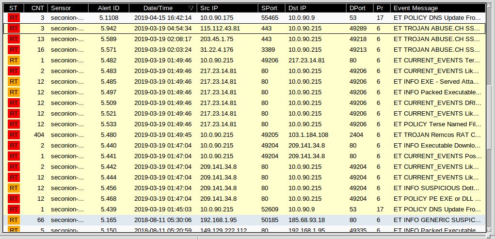 
    <em>Img 1: Alertas 3 de Marzo 2019.</em>

La marca de tiempo para la primer alerta es: 01:45:03.
La marca de tiempo para la ultima alerta es: 01:54:34.

Hay seis alertas que se hicieron a la 01:47:04 y otras ocho que se hicieron a la 01:49:46.

4. En Sguil, haga clic en la primera de las alertas del 3-19-2019 (ID de alerta 5.439). Asegúrese de marcar las casillas de verificación Mostrar datos del paquete y Mostrar regla para examinar la información del encabezado del paquete y la regla de firma IDS relacionada con la alerta. Clic derecho en el ID de alerta y pivote hacia Wireshark. Sobre la base de la información derivada de esta alerta inicial, responda a las siguientes preguntas:

    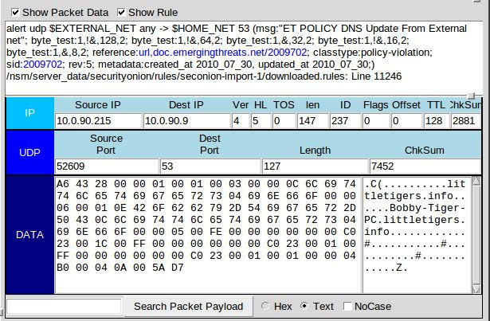 
    <em>Img 2: Alerta ID 5.439.</em>

**¿Cuál era la dirección IP de origen y el número de puerto y la dirección IP de destino y el número de puerto?**

    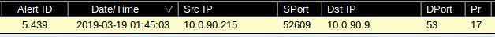 
    <em>Img 3: Src Dst.</em>

**¿Qué tipo de protocolo y solicitud o respuesta estuvo involucrado?**

    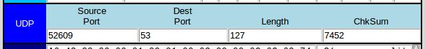 
    <em>Img 4: Protocolo en Sguil.</em>

    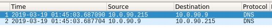 
    <em>Img 5: Protocolo en Wireshark.</em>

**¿Qué es la alerta y el mensaje de IDS?**

Es una regla de alerta de un sistema de detección de intrusiones (IDS) que monitorea el tráfico de red. El protocolo de red que se está monitoreando, en este caso, UDP (User Datagram Protocol).

`$EXTERNAL_NET any`, define la red de origen, que aquí es cualquier dirección en la red externa y el puerto de origen puede ser cualquiera.

`msg:"ET POLICY DNS Update From External net"`, el mensaje que se registrará si la regla genera una alerta.
En este caso, el mensaje indica que se detectó una "actualización de DNS desde la red externa", lo que puede ser sospechoso ya que, por lo general, las actualizaciones de DNS no deberían venir desde fuera de la red interna.

    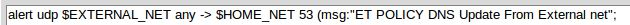 
    <em>Img 6: Mensaje IDS.</em>

**¿Cree que esta alerta fue el resultado de una mala configuración de IDS o de una comunicación sospechosa legítima?**

Esta alerta podría ser causada tanto por una configuración del IDS que sea demasiado sensible, como por un intento de comunicación sospechosa.
Las actualizaciones de DNS desde una red externa hacia una red interna son inusuales. En la mayoría de los casos, las solicitudes DNS van de la red interna hacia servidores externos y no al revés.
Si este tráfico de DNS de origen externo es frecuente o inesperado, podría ser una señal de actividades maliciosas, como un intento de manipulación DNS o una técnica de exfiltración de datos.

Si la alerta proviene de un solo evento aislado y el IDS está configurado de manera adecuada, podría ser simplemente un falso positivo. Si, en cambio, se observan múltiples alertas similares de varias fuentes o destinos, podría ser indicativo de una amenaza legítima que merece más investigación.

**¿Cuál es el nombre de host, el nombre de dominio y la dirección IP del host de origen en la actualización DNS?**

    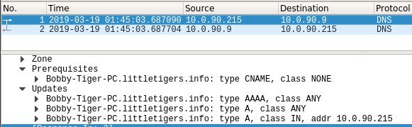 
    <em>Img 7: IP, host y dominio.</em>

El nombre del host es `Bobby-Tiger-PC`, el nombre del dominio es `littletigers.info` y la dirección IP del host de origen en la actualización es `10.0.90.9`.

5. En Sguil, seleccione la segunda de las alertas del 3-19-2019. Haga clic con el botón derecho en el ID de alerta 5.440 y seleccione Transcript.

    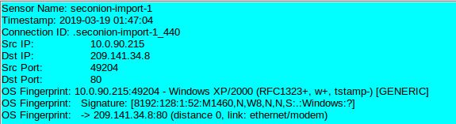 
    <em>Img 8: Origen y destino.</em>

De la trasncripción responda las siguientes preguntas.
**¿Cuáles son las direcciones MAC e IP y los números de puerto de origen y de destino?**

La direccion IP de origen es: 10.0.90.215 por el puerto 49204.
La direccion IP de destino es: 209.141.34.8 por el puerto 80.

**Mirando la solicitud (azul) ¿para qué fue la solicitud?**

    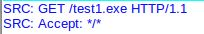 
    <em>Img 9: Solicitud.</em>

**Al mirar la respuesta (roja), muchos archivos revelarán su firma en los primeros caracteres del archivo cuando se vean como texto. Las firmas de archivo ayudan a identificar el tipo de archivo que se representa. Utilice un explorador web para buscar una lista de firmas de archivo comunes.**

**¿Cuáles son los primeros caracteres del archivo? ¿Busca esta firma de archivo para averiguar qué tipo de archivo se ha descargado en los datos?**

Los primeros caracteres del archivo son `MZ`. Esta es una firma de archivo comúnmente utilizada para identificar archivos ejecutables de Windows. El encabezado `MZ` indica que es un archivo ejecutable de DOS/Windows (Portable Executable o PE), un formato utilizado para ejecutables, bibliotecas y otros archivos binarios en sistemas Windows.

Para verificar, podemos buscar la firma MZ en una lista de firmas de archivo comunes, y encontraríamos que corresponde a un archivo ejecutable (.exe) en Windows. Esto sugiere que el archivo descargado es probablemente un archivo ejecutable diseñado para ser ejecutado en un sistema Windows.

    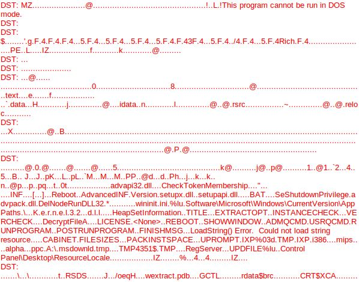 
    <em>Img 10: Caracter MZ.</em>

6. Cierre la transcripción. Utilice Wireshark para exportar el archivo ejecutable para el análisis de malware (Archivo > Exportar objetos > HTTP...). Guarde el archivo en la carpeta principal del analista.

    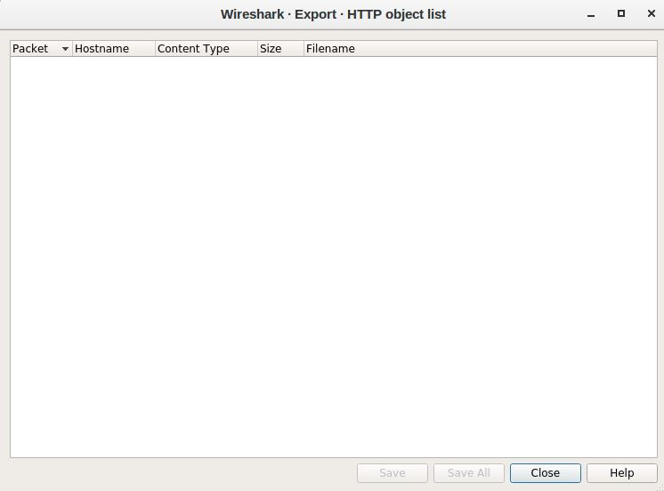 
    <em>Img 11: Exportar HTTP.</em>

Al intentar guardar/exportar el archivo, no se encuentra nada para poder realizarlo. Daremos por finalizado el trabajo practico por estos motivos.