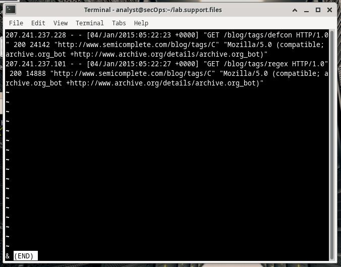
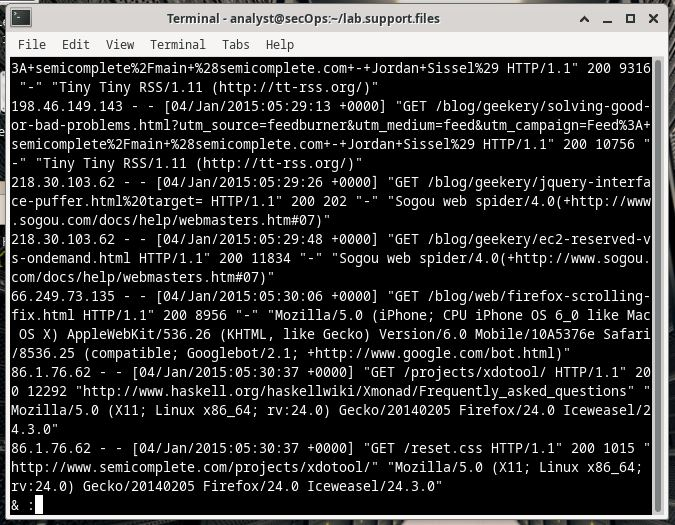

# Criptografia y Seguridad en Redes

## Trabajo Practico 2 - Laboratorio de Expresiones Regulares

### Integrantes:
- Gil Cernich, Manuel
- Mayorga, Federica

---
## Objetivo

En esta práctica de laboratorio, aprenderán a utilizar expresiones regulares para buscar las cadenas de
información que deseen.

## Antecedentes/Escenario
Una expresión regular (regex) es un patrón de símbolos que describe datos que deben coincidir en una
consulta o en cualquier otra operación. Las expresiones regulares se construyen en forma similar a las
aritméticas, utilizando diversos operadores para combinar expresiones más pequeñas. Hay dos estándares
principales de expresiones regulares: POSIX y Perl.
En esta práctica de laboratorio utilizarán un tutorial en línea para estudiar expresiones regulares. También
describirán la información que coincide con expresiones regulares dadas.

---
### Paso 1: Completar el tutorial regexone.com.

Terminado el tutorial, describir la función de algunos de los metacaracteres que se utilizan en expresiones regulares.
| Metacaracteres | Descripcion |
| :-----: | :-----: |
| $ | Sirve para definir el final de una linea, que comience con ^ |
| * | Representa cero o mas, del caracter que lo acompañe |
| . | Sirve para matchear con cualquier caracter, a modo de comodin |
| [ ] | Sirve para matchear solo uno de los caracteres dentro de los corchetes |
| \. | Representa el punto, diferenciado del metacaracter . |
| \d | Sirve para matchear con cualquier digito entre o y 9 |
| \D | Sirve para matchear con cualquier caracter que no sea un digito |
| ^ | Sirve para definir el comienzo de una linea, que termine con $ o excluir ciertos caracteres |
| {m} | Indica el numero de repeticiones del caracter que lo preceda |
| (abc\|123) | Sirve para matchear posibles diferentes grupos de caracteres |

### Paso 2: Describir el patrón de expresión regular proporcionado.
| Patrón de expresión regular | Descripcion |
| :-----: | :-----: |
|  ^83 | Matchea las cadenas de caracteres que comiencen con 83 |
| [A-Z]{2,4} | Matchea un caracter del rango A-Z que se repita entre 2 y 4 veces |
| 2015 | Matchea con la cadena de digitos 2015 |
| 05:22:2[0-9] | Matchea con un formato de tiempo con los segundos entre 20 y 29 |
| \.com | Matchea con .com | 
| complete\|GET | Matchea con la cadena complete o con la cadena GET |
| 0{4} | Matchea con 4 ceros seguidos |

### Paso 3: Verificar sus respuestas.
En este paso se verificaran las respuestas del paso anterior con un archivo de texto almacenado en la VM CyberOps Workstation.

